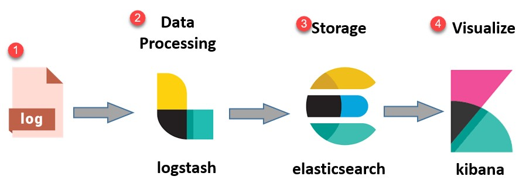
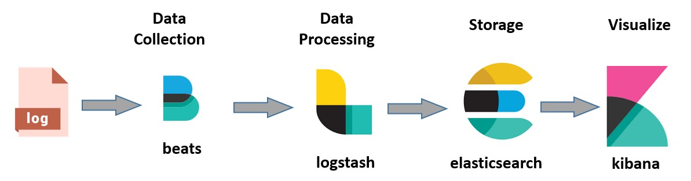
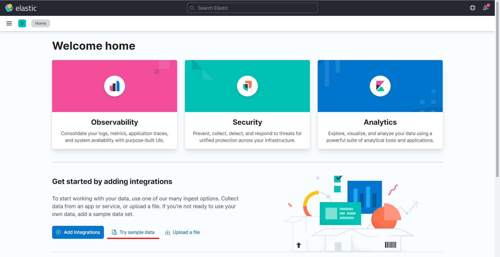
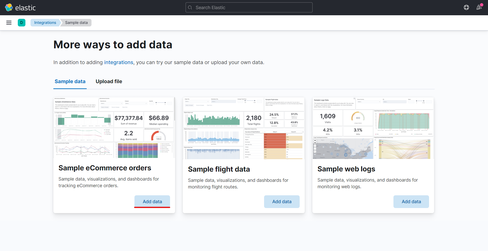
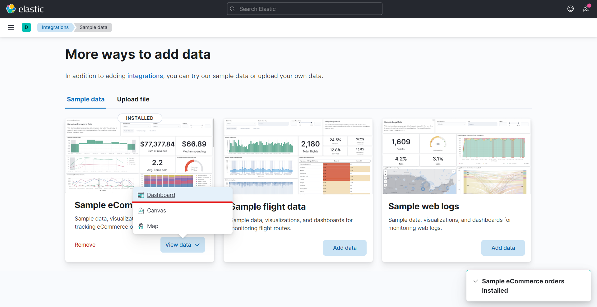
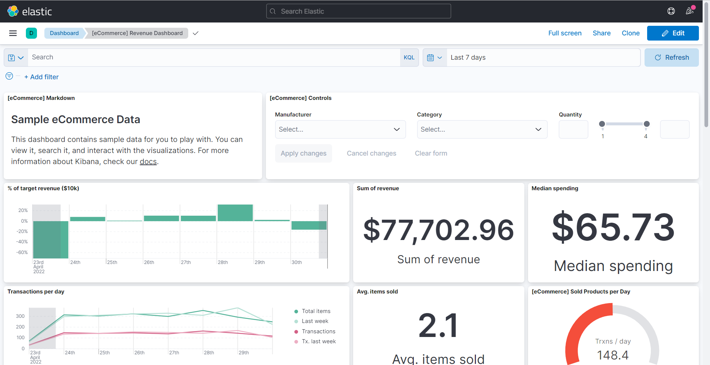

# Elasticsearch and Elastic Stack explained
Brief presentation about Elasticsearch and Elastic Stack as well as quick tutorial on how to make it up and running on your machine using Docker 

## Table of contents:
1. [What is Elasticsearch?](#what-is-elasticsearch)
   1. [Features](#features-of-elastic-search)
   2. [Advantages](#advantages-of-elasticsearch)
   3. [Key terms](#key-terms-used-in-elasticsearch)
2. [What is Kibana?](#what-is-kibana)
   1. [Features](#features-of-kibana)
   2. [Advantages](#advantages-of-kibana)
   3. [Most common search types](#kibanas-most-common-search-types)
3. [Elastic Stack](#elastic-stack)
   1. [What is ELK Stack?](#what-is-elk-stack)
   2. [What is ELK Stack architecture?](#what-is-elk-stack-architecture)
   3. [Why Elastic Stack?](#why-elastic-stack)
4. [Creating our own instance using Docker Compose](#creating-our-own-instance-using-docker-compose)
   1. [Prepare you workspace](#prepare-you-workspace)
   2. [`docker-compose` configuration](#docker-compose-configuration)
   3. [Run it using Docker Engine](#run-it-using-docker-engine)
   4. [How to reach Elasticsearch?](#how-to-reach-elasticsearch)
   5. [How to reach Kibana?](#how-to-reach-kibana)

## What is Elasticsearch?
__Elasticsearch is a NoSQL database.__ It is based on Lucene search engine, and it is built with RESTful APIS. It offers simple deployment, maximum reliability, and easy management. It also offers advanced queries to perform detail analysis and stores all the data centrally. __It is helpful for executing a quick search of the documents.__

Elasticsearch also allows you to store, search and analyze big volume of data. __It is mostly used as the underlying engine to powers applications that completed search requirements.__ It has been adopted in search engine platforms for modern web and mobile applications. Apart from a quick search, the tool also offers complex analytics and many advanced features.

### Features of Elastic search
- Open source search server is written using Java
- Used to index any kind of heterogeneous data
- Has REST API web-interface with JSON output
- Full-Text Search
- Near Real Time (NRT) search
- Sharded, replicated searchable, JSON document store
- Schema-free, REST & JSON based distributed document store
- Multi-language & Geolocation support

### Advantages of Elasticsearch
- Store schema-less data and also creates a schema for your data
- Manipulate your data record by record with the help of Multi-document APIs
- Perform filtering and querying your data for insights
- Based on Apache Lucene and provides RESTful API
- Provides horizontal scalability, reliability, and multitenant capability for real time use of indexing to make it faster search
- Helps you to scale vertically and horizontally

### Key terms used in Elasticsearch
Term | Usage
--- | ---
`Cluster` | A cluster is a collection of nodes which together holds data and provides joined indexing and search capabilities.
`Node` | A node is an elasticsearch Instance. It is created when an elasticsearch instance begins.
`Index` | An index is a collection of documents which has similar characteristics. e.g., customer data, product catalog. It is very useful while performing indexing, search, update, and delete operations. It allows you to define as many indexes in one single cluster.
`Document` | It is the basic unit of information which can be indexed. It is expressed in JSON (key: value) pair. `{"user": "e3stpavel"}`. Every single Document is associated with a type and a unique id.
`Shard` | Every index can be split into several shards to be able to distribute data. The shard is the atomic part of an index, which can be distributed over the cluster if you want to add more nodes.

## What is Kibana?
As written in official Elastic web site:
> Kibana lets you visualize your Elasticsearch data and navigate the Elastic Stack, so you can do anything from learning why you're getting paged at 2:00 a.m. to understanding the impact rain might have on your quarterly numbers.

__Basically Kibana is a data visualization__ which completes the ELK stack. This tool is used for visualizing the Elasticsearch documents and helps developers to have a quick insight into it. Kibana dashboard offers various interactive diagrams, geospatial data, and graphs to visualize complex quires.

It can be used for search, view, and interact with data stored in Elasticsearch directories. Kibana helps you to perform advanced data analysis and visualize your data in a variety of tables, charts, and maps. 

### Features of Kibana
- Powerful front-end dashboard which is capable of visualizing indexed information from the elastic cluster
- Enables real-time search of indexed information
- You can search, view, and interact with data stored in Elasticsearch
- Execute queries on data & visualize results in charts, tables, and maps
- Capable of providing historical data in the form of graphs, charts, etc.
- Real-time dashboards which is easily configurable
- Kibana ElasticSearch enables real-time search of indexed information

### Advantages of Kibana
- Easy visualizing
- Fully integrated with Elasticsearch
- Visualization tool
- Offers real-time analysis, charting, summarization, and debugging capabilities
- Provides instinctive and user-friendly interface
- Permits saving the dashboard and managing multiple dashboards

### Kibana's most common search types
In Kibana there are different methods for performing searches on your data. However the most common search types are:

Search Type | Usage
--- | ---
Free text searches | It is used for searching a specific string
Field-level searches | It is used for searching for a string within a specific field
Logical statements | It is used to combine searches into a logical statement.
Proximity searches | It is used for searching terms within specific character proximity.

## Elastic Stack
__Elastic Stack is a group of open source products from Elastic__ designed to help users take data from any type of source and in any format and search, analyze, and visualize that data in real time. __The product group was formerly known as ELK Stack.__ 

### What is ELK Stack?
__ELK Stack provides centralized logging in order to identify problems with servers or applications.__ It allows you to search all the logs in a single place. It also helps to find issues in multiple servers by connecting logs during a specific time frame.

__ELK Stack is designed to allow users to take data from any source, in any format, and to search, analyze, and visualize that data in real time.__

Letter | Stands For
--- | ---
E | __ElasticSearch__: used for storing logs
L | __LogStash__: used for both shipping as well as processing and storing logs
K | __Kibana__: is a visualization tool (a web interface) which is hosted through Nginx or Apache

### What is ELK Stack architecture?
The following table shows the compound of ELK Stack architecture. 
Service | Description
--- | ---
Logs | Server logs that need to be analyzed are identified
Logstash | Collect logs and events data. It even parses and transforms data
Elasticsearch | The transformed data from Logstash is stored, searched and indexed
Kibana | Kibana uses Elasticsearch database to explore, visualize and share

### Why Elastic Stack?

However, one more component is needed or Data collection called __Beats__. 

__Beats are "data shippers"__ that are installed on servers as agents used to send different types of operational data to Elasticsearch either directly or through Logstash, where the data might be enhanced or archived.

This led Elastic to rename ELK as the __Elastic Stack__.

## Creating our own instance using Docker Compose
For this tutorial we gonna run an __Elasticsearch single node cluster with Kibana using `docker-compose`__.

_NB! In order to run it you need to have Docker installed on your machine._

_NB! This `docker-compose` configuration is valid for Elasticsearch version 7 or higher._

### Prepare you workspace
Create the folder or use existing one to run Elasticsearch. 

### `docker-compose` configuration
To get the `docker-compose.yml` file you can simply clone this repo by using following command:

`git clone https://github.com/e3stpavel/elasticsearch.git . `

_NB! The following command requires `git` and will clone all the repository contents into the current directory._

### Run it using Docker Engine
In order to run Elasticsearch and Kibana use simply the following command:

`docker-compose up -d`

If you want to stop it use:

`docker-compose stop`

If you need to destroy:

`docker-compose down --volumes`

### How to reach Elasticsearch?
You can reach Elasticsearch at `http://localhost:9200`. That's useful for development purposes.

### How to reach Kibana?
Kibana will be running at `http://localhost:5601` and you can simply open it in your favourite web browser.

## Using Kibana for data visualisation
To quickly get up and running with Kibana we will add a sample data set that we can explore and analyze.

### Add the sample data
Sample data sets come with sample visualizations, dashboards, and more to help you explore Kibana before you ingest or add your own data.

To add a sample data set let's move to the __"Home"__ and under the __"Get started by adding integrations"__ section click __"Try sample data"__ button.

For this tutorial let's select __"Sample eCommerce orders"__ sample data set. Click __"Add data"__ button.

After this you will get the message in left bottom corner that the data was added.

### View and analyze the data
Let's move to the __"Dashboard"__ by clicking on __"View Data"__ and selecting the __"Dashboard"__ in the drop down menu.

The __"Dashboard"__ should look like this:

